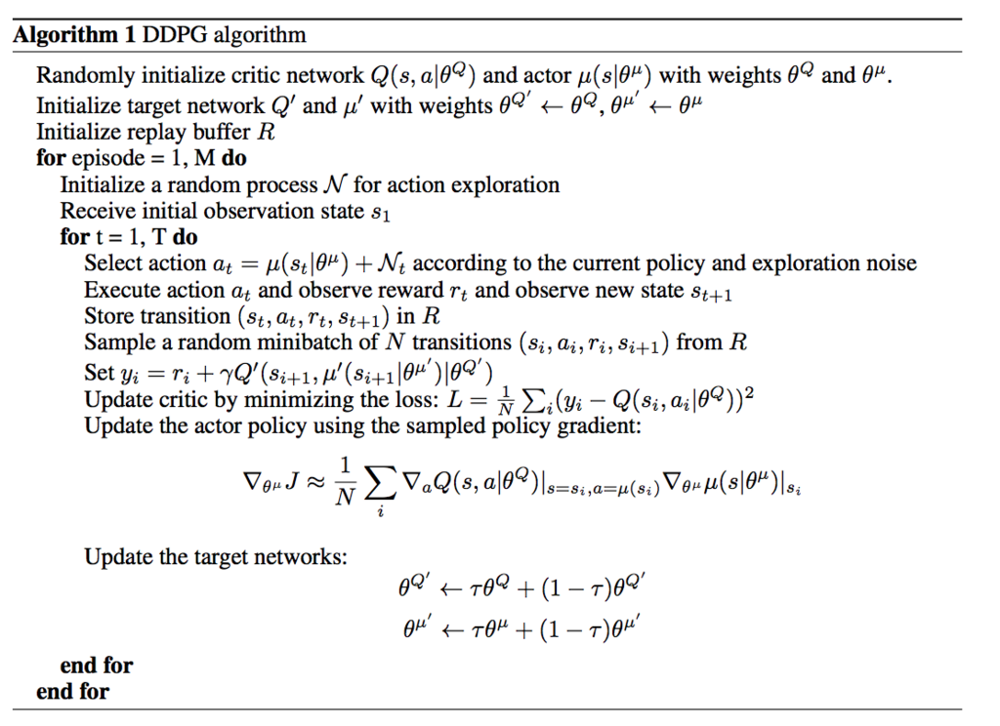
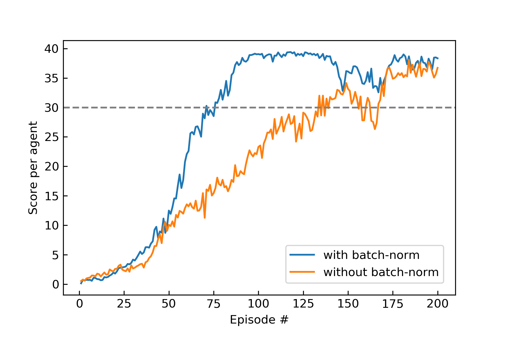

[//]: # (Image References)

[image1]: media/Reacher_Random.gif "Random Agents"
[image2]: media/Reacher_Trained.gif "Trained Agents"

# Report : Continuous Control in Reacher Environment

**For this project, you implement Deep Deterministic Policy Gradient (DDPG) and confirm the effect of Batch normalization.** 

## Learning Algorithm

Deep Deterministic Policy Gradient (DDPG) is the one of Actor-Critic algorithm which simultaneously learns an action-value function Q(s,a) and a policy. 
In the DDPG algorithm actor plays a role in taking deterministic action following a policy and critic evaluates the action by the actor based on the TD error. 
Two neural networks are used as function approximator of actor and critic, 
and as same with DQN algorithm (cf. [see more details](https://github.com/4kasha/Navigation_DQN/blob/master/Report.md)), the learning is performed based on **Experience replay** and **Fixed Q-Targets**. 

Additionally in the DQN learning action is selected such that  under the epsilon-greedy selection, this is however impossible for taking continuos action and the deterministic policy case.  
Therefore for the purpose of exploring action space and obtaining useful learning signal a kind of noise is intentionally added to the output of actor.
In the [original paper][ref2] time-correlated noise produced by [Ornstein-Uhlenbeck process][ref3] is suggested. (but recent results report that uncorrelated, zero mean Gaussian noise works well.) 
By virtue of [Deterministic Policy Gradient Theorem][ref1] the analytical expression for policy gradient can be derived, then the pseudocode for DDPG algorithm is as follows.

## Hyperparameters

The following hyperparameters specify the learning structure (see `agents.py`).

|name|value|description|
|:--:|:--:|:--:|
|BUFFER_SIZE|1e6|replay buffer size|
|BATCH_SIZE|256|minibatch size|
|GAMMA|0.99|discount factor|
|TAU|1e-3|for soft update of target parameters|
|LR_ACTOR|1e-4|learning rate of the actor|
|LR_CRITIC|1e-3|learning rate of the critic|
|WEIGHT_DECAY|0|L2 weight decay|
|UPDATE_EVERY|10|how often to update the target network|
|NUM_UPDATES|5|number of the update at each step|
|THETA|0.15|parameter for Ornstein-Uhlenbeck process|
|SIGMA|0.2|parameter for Ornstein-Uhlenbeck process and Gaussian noise|

## Parameters for training
- n_episodes (=**200**) : maximum number of training episodes
- eps_start (=**1.0**) : starting value of epsilon, for exploration action space
- eps_end (=**0.01**) : minimum value of epsilon
- eps_decay (=**0.9999**) : multiplicative factor (per episode) for decreasing epsilon
- goal_score (=**30.0**) : average score to be required
- noise (=**OU**): noise type for action, gauss (Gaussian) or OU (Ornstein-Uhlenbeck process)
- mode (=**"multi"**): if you use a single agent version, set mode="single".  

## Network Structure

The network structure consists of Actor and Critic network and this is written in `model.py`.  
The corresponding parameters are as follow.

- hidden_layers (list): size of hidden_layers
- use_bn (bool): use batch normalization or not
- use_reset (=**True**): weights and bias initialization used in the [original paper][ref2] to ensure the initial outputs for the policy and value estimates are near zero.

1. Actor
    - 2 hidden layers with 256 and 128 nodes respectively.
    - Batch normalization at each layer.
    - Relu activation function after the Batch normalization.
    - Tanh() at the output layer to ensure the action takes the value in [-1,1]

2. Critic
    - 2 hidden layers with 256 and 128 nodes respectively.
    - Batch normalization only at iput and the first hidden layer.
    - Actions are inserted at the second hidden layer as same with the [original paper][ref2].
    - Relu activation function for each layer.

## Plot of Rewards

A reward of +0.1 is provided for each step that the agent's hand is in the goal location. 

- **_Version 1: One (1) Agent_**

    The task is episodic, and in order to solve the environment, your agent must get an average score of +30 over 100 consecutive episodes.

- **_Version 2: Twenty (20) Agents_**
    
    The barrier for solving the second version of the environment is slightly different, to take into account the presence of many agents. In particular, your agents must get an average score of +30 (over 100 consecutive episodes, and over all agents). 

In this report, the results of learning with/without batch normalization using 20 agents (Version 2) are illustrated in the below figure. 
The number of episodes needed to solve this environment is **37 episodes**. 
This number is however prone to highly depend on the random seed (see. [CC_Results_Example.ipynb](CC_Results_Example.ipynb)).
The batch normalization, which is the normalization across the minibatch of states to have unit mean and variance, leads to the efficiency in the training. As is mentioned in the [original paper][ref2], states vector of the environment in general include various kinds of physical quantities (such as position, velocity) and these have differnt scales. In the trainning without batch normalization this causes the inefficiencies of the learnng.

The following videos are a behaviour of random agents and trained agents with DDPG respectively.

![Trained Agent][image1]
![rotation][image2]

## Ideas for Future Work

### Plan to implement the following algorithms

- [PPO](https://arxiv.org/pdf/1707.06347.pdf) (cf. the [repo](https://github.com/4kasha/CartPole_PPO) for the discrete action case)
- [A3C](https://arxiv.org/pdf/1602.01783.pdf)

## Reference

- [D. Silver, et al. "Deterministic Policy Gradient Algorithms"][ref1], ["Supplementary Material"][ref1-2] 
- [Timothy P. Lillicrap, et al. "CONTINUOUS CONTROL WITH DEEP REINFORCEMENT LEARNING"][ref2]
- [Implementing Ornstein–Uhlenbeck in Matlab][ref3]
- [OpenAI : Deep Deterministic Policy Gradient][ref4] 

[ref1]: http://proceedings.mlr.press/v32/silver14.pdf
[ref1-2]:http://proceedings.mlr.press/v32/silver14-supp.pdf
[ref2]: https://arxiv.org/abs/1509.02971
[ref3]: https://math.stackexchange.com/questions/1287634/implementing-ornstein-uhlenbeck-in-matlab
[ref4]: https://spinningup.openai.com/en/latest/algorithms/ddpg.html